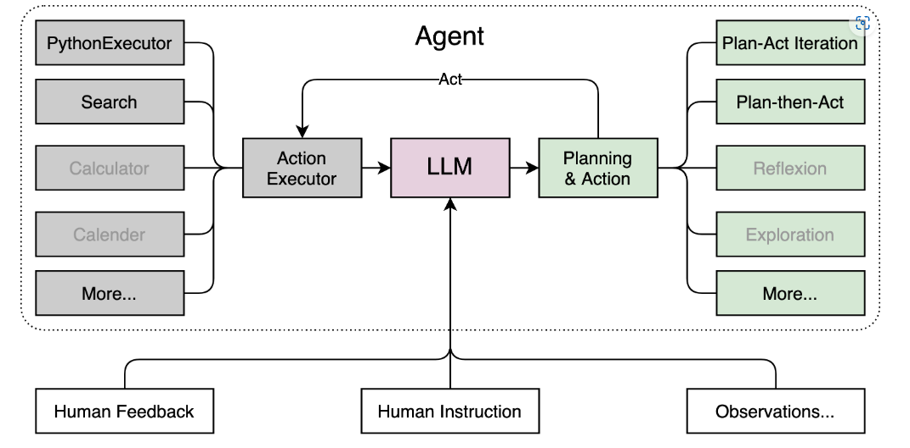

# 轻松玩转书生·浦语大模型趣味 Demo
- [轻松玩转书生·浦语大模型趣味 Demo](#轻松玩转书生浦语大模型趣味-demo)
  - [1 大模型及 InternLM 模型简介](#1-大模型及-internlm-模型简介)
    - [1.1 什么是大模型？](#11-什么是大模型)
    - [1.2 InternLM 模型全链条开源](#12-internlm-模型全链条开源)
  - [2 InternLM-Chat-7B 智能对话 Demo](#2-internlm-chat-7b-智能对话-demo)
    - [2.1 环境准备](#21-环境准备)
    - [2.2 模型下载](#22-模型下载)
    - [2.3 代码准备](#23-代码准备)
    - [2.4 终端运行](#24-终端运行)
    - [2.5 web demo 运行](#25-web-demo-运行)
  - [3 Lagent 智能体工具调用 Demo](#3-lagent-智能体工具调用-demo)
    - [3.1 环境准备](#31-环境准备)
    - [3.2 模型下载](#32-模型下载)
    - [3.3 Lagent 安装](#33-lagent-安装)
    - [3.4 修改代码](#34-修改代码)
    - [3.5 Demo 运行](#35-demo-运行)
  - [4. 浦语·灵笔图文理解创作 Demo](#4-浦语灵笔图文理解创作-demo)
    - [4.1 环境准备](#41-环境准备)
    - [4.2 模型下载](#42-模型下载)
    - [4.3 代码准备](#43-代码准备)
    - [4.4 Demo 运行](#44-demo-运行)
  - [5. 通用环境配置](#5-通用环境配置)
    - [5.1 pip、conda 换源](#51-pipconda-换源)
      - [5.1.1 pip 换源](#511-pip-换源)
      - [5.1.2 conda 换源](#512-conda-换源)
    - [5.2 配置本地端口](#52-配置本地端口)
    - [5.3 模型下载](#53-模型下载)
      - [5.3.1 Hugging Face](#531-hugging-face)
      - [5.3.2 ModelScope](#532-modelscope)
      - [5.3.3 OpenXLab](#533-openxlab)
  - [6. 课后作业](#6-课后作业)

## 1 大模型及 InternLM 模型简介

### 1.1 什么是大模型？

&emsp;&emsp;大模型通常指的是机器学习或人工智能领域中参数数量巨大、拥有庞大计算能力和参数规模的模型。这些模型利用大量数据进行训练，并且拥有数十亿甚至数千亿个参数。大模型的出现和发展得益于增长的数据量、计算能力的提升以及算法优化等因素。这些模型在各种任务中展现出惊人的性能，比如自然语言处理、计算机视觉、语音识别等。这种模型通常采用深度神经网络结构，如 `Transformer`、`BERT`、`GPT`（ Generative Pre-trained Transformer ）等。

&emsp;&emsp;大模型的优势在于其能够捕捉和理解数据中更为复杂、抽象的特征和关系。通过大规模参数的学习，它们可以提高在各种任务上的泛化能力，并在未经过大量特定领域数据训练的情况下实现较好的表现。然而，大模型也面临着一些挑战，比如巨大的计算资源需求、高昂的训练成本、对大规模数据的依赖以及模型的可解释性等问题。因此，大模型的应用和发展也需要在性能、成本和道德等多个方面进行权衡和考量。

### 1.2 InternLM 模型全链条开源

&emsp;&emsp;`InternLM` 是一个开源的轻量级训练框架，旨在支持大模型训练而无需大量的依赖。通过单一的代码库，它支持在拥有数千个 `GPU` 的大型集群上进行预训练，并在单个 `GPU` 上进行微调，同时实现了卓越的性能优化。在 `1024` 个 `GPU` 上训练时，`InternLM` 可以实现近 `90%` 的加速效率。

&emsp;&emsp;基于 `InternLM` 训练框架，上海人工智能实验室已经发布了两个开源的预训练模型：`InternLM-7B` 和 `InternLM-20B`。

&emsp;&emsp;`Lagent` 是一个轻量级、开源的基于大语言模型的智能体（agent）框架，支持用户快速地将一个大语言模型转变为多种类型的智能体，并提供了一些典型工具为大语言模型赋能。通过 `Lagent` 框架可以更好的发挥 `InternLM` 的全部性能。

![Lagent 框架图]

&emsp;&emsp;浦语·灵笔是基于书生·浦语大语言模型研发的视觉-语言大模型，提供出色的图文理解和创作能力，结合了视觉和语言的先进技术，能够实现图像到文本、文本到图像的双向转换。使用浦语·灵笔大模型可以轻松的创作一篇图文推文，也能够轻松识别一张图片中的物体，并生成对应的文本描述。

&emsp;&emsp;建议大家来给 `InternLM`: https://github.com/InternLM/InternLM/ 点点 star ！

