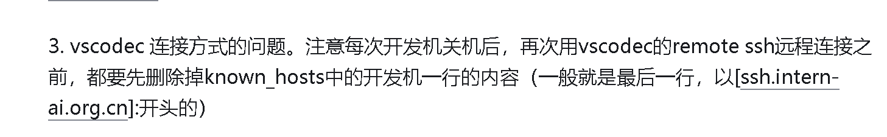

#### 环境初始化

非官方安装教程：[datawhalechina/self-llm: 《开源大模型食用指南》基于AutoDL快速部署开源大模型，更适合中国宝宝的部署教程 (github.com)](https://github.com/datawhalechina/self-llm/tree/master)

[‌⁤‍⁤⁣⁣‬⁢‍⁣⁡⁢⁣⁤‍⁢‌⁡‌‬‬‌‌⁡‍⁣⁤⁡‌‬‍⁢‌‌‌‬⁣⁢‍👍 SSH 连接开发机 - 飞书云文档 (feishu.cn)](https://aicarrier.feishu.cn/wiki/VLS7w5I22iQWmTk0ExpczIKcnpf)

//vscode SSH连接开发机

2. 若不是第一次连接，关机后开机再连接，提示无法连接：

    1. 删除.ssh文件夹下的known_hosts文件

**安装tmux分离会话，避免异常中断链接造成运行任务中断**

综上所述，以下是 Tmux 的最简操作流程。

[Tmux 使用教程 - 阮一峰的网络日志 (ruanyifeng.com)](https://www.ruanyifeng.com/blog/2019/10/tmux.html)

> 1. 新建会话`tmux new -s my_session`。
> 2. 在 Tmux 窗口运行所需的程序。
> 3. 按下快捷键`Ctrl+b d`将会话分离。
> 4. 下次使用时，重新连接到会话`tmux attach-session -t my_session`。
>
+--------+------------+----------------------------------------------------------------------+
|  目录  |    名称    |                              简介                                    |
+--------+------------+----------------------------------------------------------------------+
|   /    |  系统目录  | 每次停止开发机会将其恢复至系统（镜像）初始状态。不建议存储数据。     |
+--------+------------+----------------------------------------------------------------------+
| /root  | 用户家目录 | 您的所有开发机共享此目录，不受开发机的启停影响。强烈建议将 conda     |
|        |            | 环境、代码仓库等所有数据存储在此目录下。                             |
+--------+------------+----------------------------------------------------------------------+
| /share |  共享目录  | 常用微调数据集、模型仓库、教程、xtuner 配置文件都存放在此。          |
+--------+------------+----------------------------------------------------------------------+
Tips:
  
