##### 第三课

> ##### 第三课 ((20240107225749-y9y72ts "*"))
>
> 今天邹老师带你使用LangChain+InternLM的RAG向量检索外挂知识库的方式，拓展你模型的知识边界~
>
> 视频链接：https://www.bilibili.com/video/BV1sT4y1p71V/
> 操作文档：https://github.com/InternLM/tutorial/tree/main/langchain
>
> 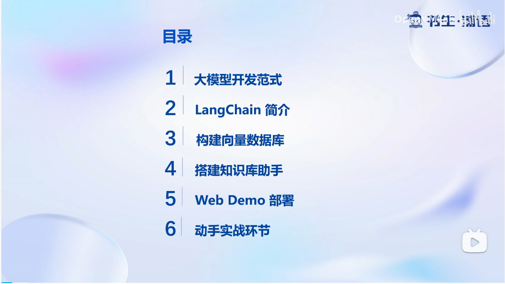
>
> 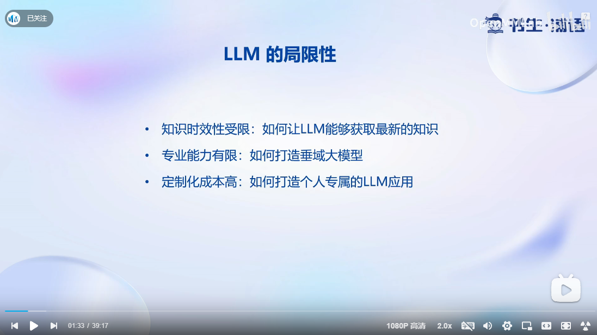
>
> * **引入微调技术解决LLM局限性问题，常见微调技术方向对比**
>
> 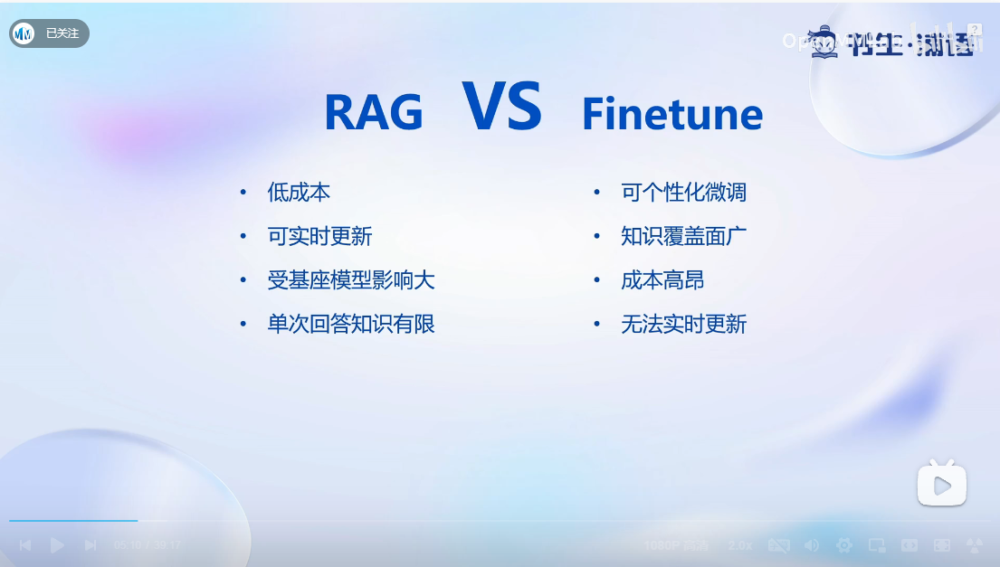
>
> 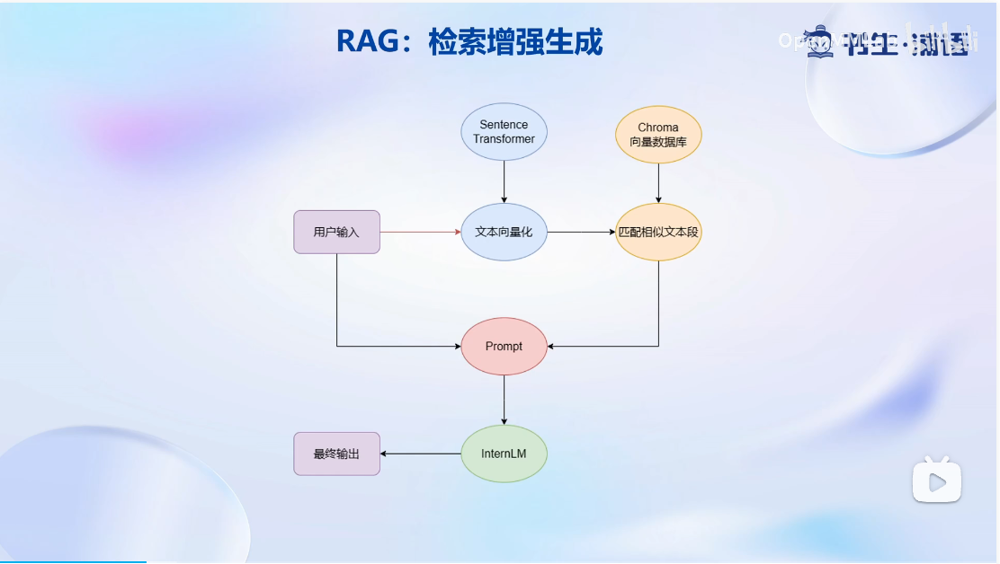
>
> * **借助LangChain框架实现RAG全流程**
>
> 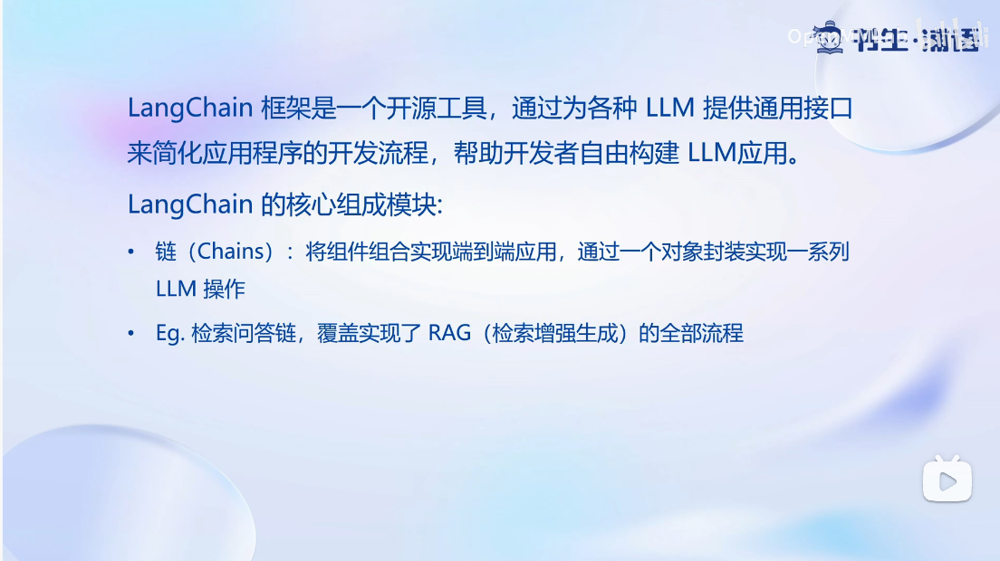
>
> 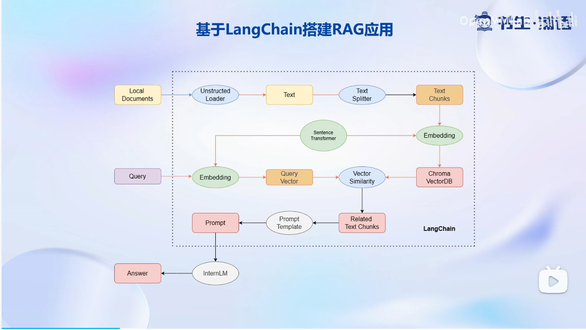
>
> 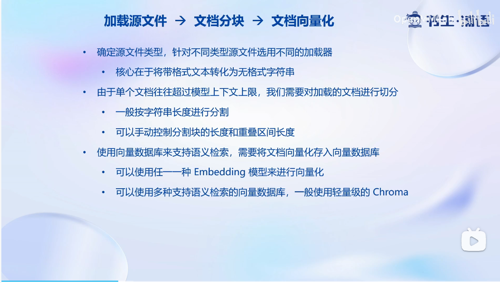
>
> * **搭建本地知识库实现思路**
>
>   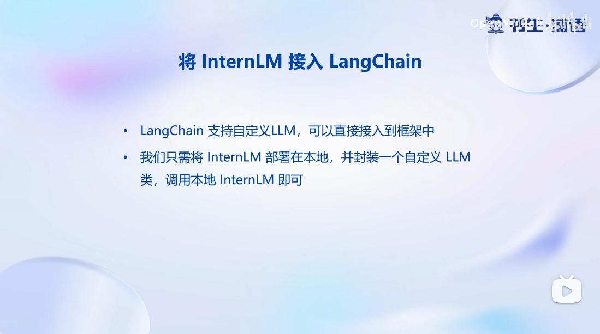
> * 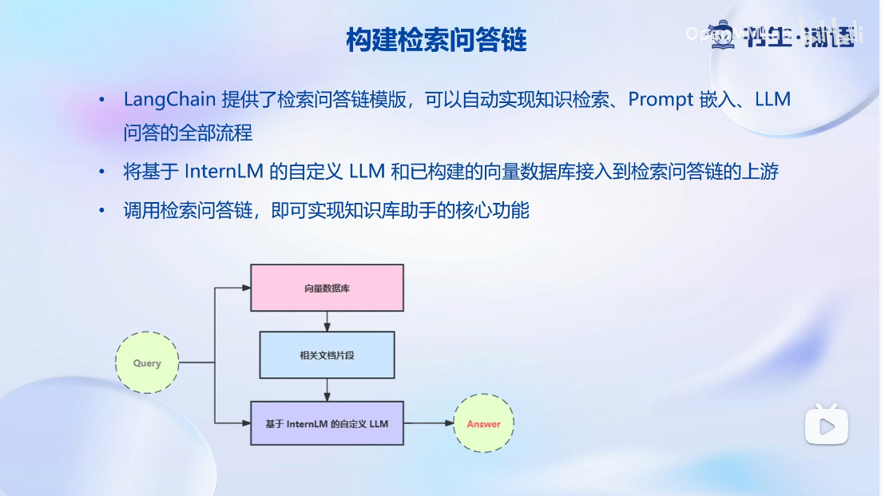
> * **方案局限与优化建议**
>
>   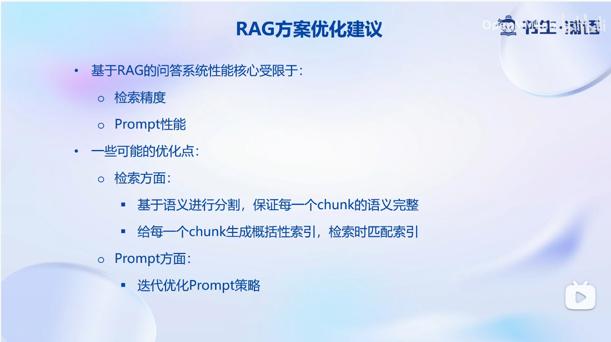
> * 借助web部署框架，呈现最终结果
>
>   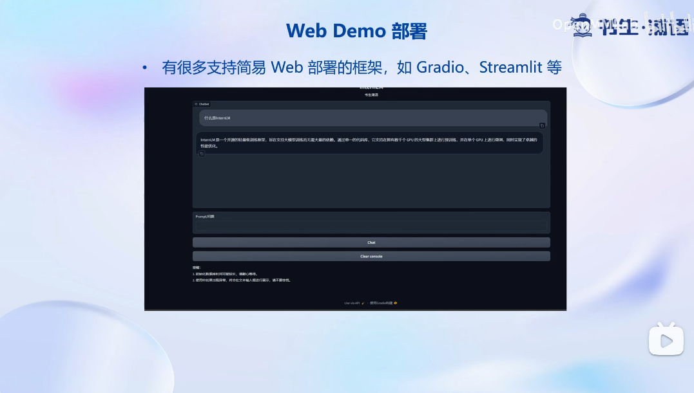
>
>
