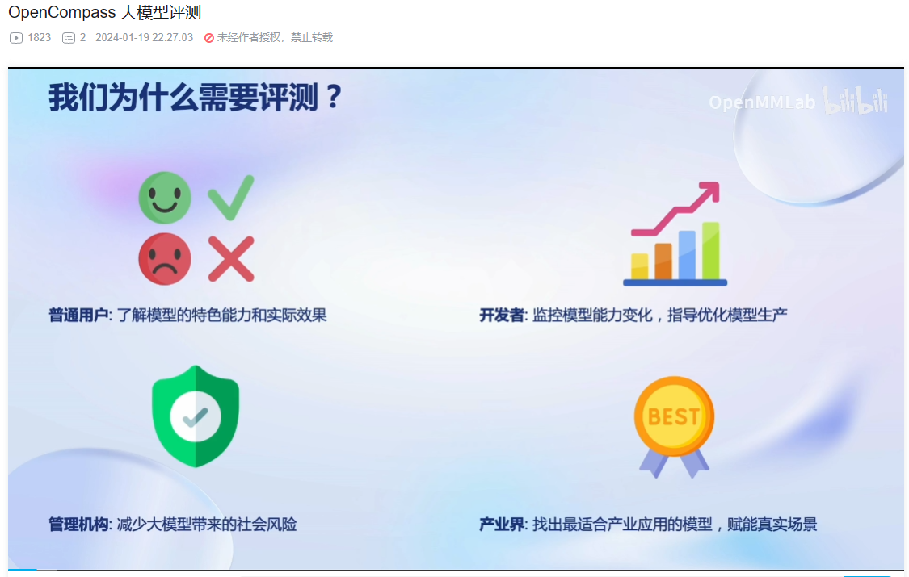
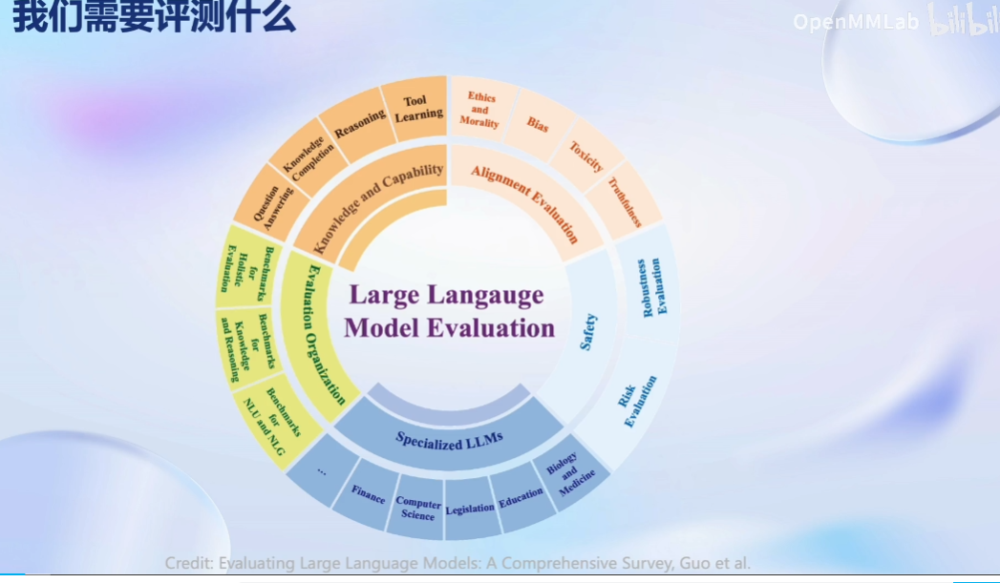
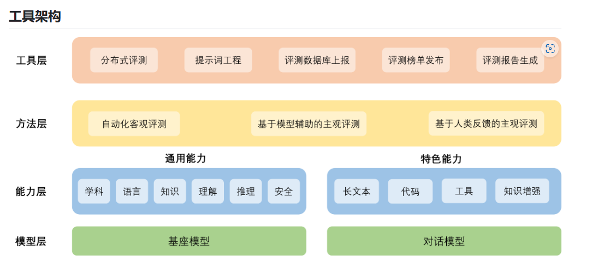
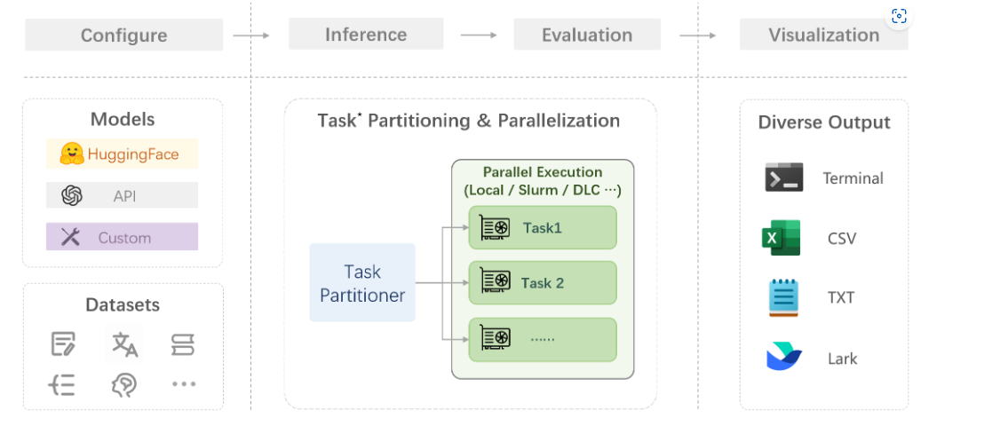

###### LMDeploy 的量化和部署

##### 为什么要大模型评测？

##### 评测大模型的什么？

##### OpenCompass介绍
随着大模型的蓬勃发展，如何全面系统地评估大模型的各项能力成为了亟待解决的问题。由于大语言模型和多模态模型的能力强大，应用场景广泛，目前学术界和工业界的评测方案往往只关注模型的部分能力维度，缺少系统化的能力维度框架与评测方案。OpenCompass提供设计一套全面、高效、可拓展的大模型评测方案，对模型能力、性能、安全性等进行全方位的评估。OpenCompass提供分布式自动化的评测系统，支持对(语言/多模态)大模型开展全面系统的能力评估。

本算法库的主要评测对象为语言大模型与多模态大模型。
## 工具架构

* 模型层：大模型评测所涉及的主要模型种类，OpenCompass以基座模型和对话模型作为重点评测对象。
* 能力层：OpenCompass从本方案从通用能力和特色能力两个方面来进行评测维度设计。在模型通用能力方面，从语言、知识、理解、推理、安全等多个能力维度进行评测。在特色能力方面，从长文本、代码、工具、知识增强等维度进行评测。
* 方法层：OpenCompass采用客观评测与主观评测两种评测方式。客观评测能便捷地评估模型在具有确定答案（如选择，填空，封闭式问答等）的任务上的能力，主观评测能评估用户对模型回复的真实满意度，OpenCompass采用基于模型辅助的主观评测和基于人类反馈的主观评测两种方式。
* 工具层：OpenCompass提供丰富的功能支持自动化地开展大语言模型的高效评测。包括分布式评测技术，提示词工程，对接评测数据库，评测榜单发布，评测报告生成等诸多功能。

## 能力维度

### 设计思路

为准确、全面、系统化地评估大语言模型的能力，OpenCompass从通用人工智能的角度出发，结合学术界的前沿进展和工业界的最佳实践，提出一套面向实际应用的模型能力评价体系。OpenCompass能力维度体系涵盖通用能力和特色能力两大部分。

通用能力涵盖学科综合能力、知识能力、语言能力、理解能力、推理能力、安全能力，共计六大维度构造立体全面的模型能力评价体系。

特色能力

## 评测方法

OpenCompass采取客观评测与主观评测相结合的方法。针对具有确定性答案的能力维度和场景，通过构造丰富完善的评测集，对模型能力进行综合评价。针对体现模型能力的开放式或半开放式的问题、模型安全问题等，采用主客观相结合的评测方式。

### 客观评测

针对具有标准答案的客观问题，我们可以我们可以通过使用定量指标比较模型的输出与标准答案的差异，并根据结果衡量模型的性能。同时，由于大语言模型输出自由度较高，在评测阶段，我们需要对其输入和输出作一定的规范和设计，尽可能减少噪声输出在评测阶段的影响，才能对模型的能力有更加完整和客观的评价。

为了更好地激发出模型在题目测试领域的能力，并引导模型按照一定的模板输出答案，OpenCompass采用提示词工程 （prompt engineering）和语境学习（in-context learning）进行客观评测。

在客观评测的具体实践中，我们通常采用下列两种方式进行模型输出结果的评测：

* **判别式评测**：该评测方式基于将问题与候选答案组合在一起，计算模型在所有组合上的困惑度（perplexity），并选择困惑度最小的答案作为模型的最终输出。例如，若模型在 `问题? 答案1` 上的困惑度为 0.1，在 `问题? 答案2` 上的困惑度为 0.2，最终我们会选择 `答案1` 作为模型的输出。
* **生成式评测**：该评测方式主要用于生成类任务，如语言翻译、程序生成、逻辑分析题等。具体实践时，使用问题作为模型的原始输入，并留白答案区域待模型进行后续补全。我们通常还需要对其输出进行后处理，以保证输出满足数据集的要求。

### 主观评测

语言表达生动精彩，变化丰富，大量的场景和能力无法凭借客观指标进行评测。针对如模型安全和模型语言能力的评测，以人的主观感受为主的评测更能体现模型的真实能力，并更符合大模型的实际使用场景。

OpenCompass采取的主观评测方案是指借助受试者的主观判断对具有对话能力的大语言模型进行能力评测。在具体实践中，我们提前基于模型的能力维度构建主观测试问题集合，并将不同模型对于同一问题的不同回复展现给受试者，收集受试者基于主观感受的评分。由于主观测试成本高昂，本方案同时也采用使用性能优异的大语言模拟人类进行主观打分。在实际评测中，本文将采用真实人类专家的主观评测与基于模型打分的主观评测相结合的方式开展模型能力评估。

在具体开展主观评测时，OpenComapss采用**单模型回复满意度统计**和**多模型满意度比较**两种方式开展具体的评测工作。

# 快速开始

## 概览

在 OpenCompass 中评估一个模型通常包括以下几个阶段：**配置** -> **推理** -> **评估** -> **可视化**。

**配置**：这是整个工作流的起点。您需要配置整个评估过程，选择要评估的模型和数据集。此外，还可以选择评估策略、计算后端等，并定义显示结果的方式。

**推理与评估**：在这个阶段，OpenCompass 将会开始对模型和数据集进行并行推理和评估。**推理**阶段主要是让模型从数据集产生输出，而**评估**阶段则是衡量这些输出与标准答案的匹配程度。这两个过程会被拆分为多个同时运行的“任务”以提高效率，但请注意，如果计算资源有限，这种策略可能会使评测变得更慢。

**可视化**：评估完成后，OpenCompass 将结果整理成易读的表格，并将其保存为 CSV 和 TXT 文件。你也可以激活飞书状态上报功能，此后可以在飞书客户端中及时获得评测状态报告。

github上展示了 OpenCompass 的基础用法，展示书生浦语在 [C-Eval](https://cevalbenchmark.com/index.html#home) 基准任务上的评估。它们的配置文件可以在 [configs/eval_demo.py](https://github.com/open-compass/opencompass/blob/main/configs/eval_demo.py) 中找到。